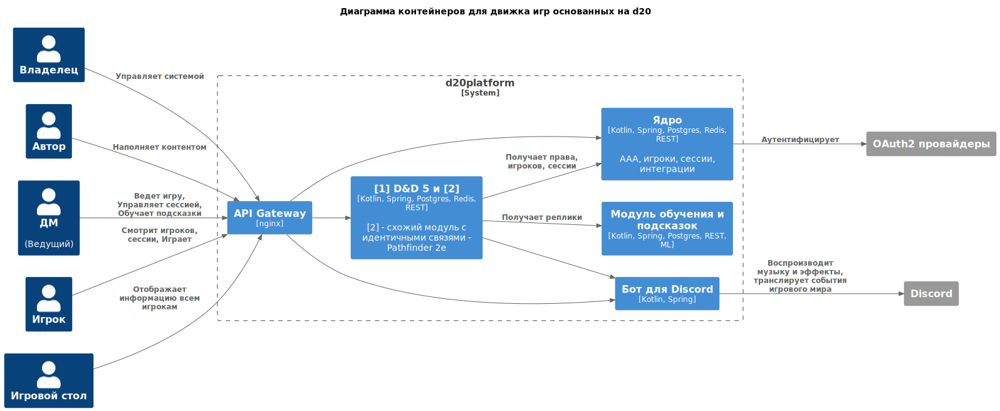

# ADR3. Верхнеуровневые модули и их связи, диаграмма контейнеров

| Актуальное | Принято 22.07.23                          |
|------------|-------------------------------------------|
| Участники  | Бутаков М.В.                              |
| Изменения  | 21.07.23 - Создано 22.07.23 - Принято |

Задача: выявить функциональные требования, выявить значимые нефункциональные требования.

<!-- TOC -->
* [ADR3. Верхнеуровневые модули и их связи, диаграмма контейнеров](#adr3-верхнеуровневые-модули-и-их-связи-диаграмма-контейнеров)
  * [Модули](#модули)
  * [Связи](#связи)
  * [Диаграмма](#диаграмма)
<!-- TOC -->

## Модули

- Модуль D&D 5e
- Модуль обучения и подсказок
- Модуль, предоставляющий одни и те же функции каждому модулю игровой системы (права. пользователи, аудит, игровые
  комнаты, приглашения и поиск игроков, интеграции с внешними системами)

## Связи

- Игровой модуль во время игры получает реплики из модуля обучения. Частота - до 1 запроса раз в 5 секунд на одну
  игровую комнату
- Игровой модуль при старте игры запрашивает информацию об игроках и их правах.
- Игрок и ДМ при входе в систему обращаются к модулю-ядру, который в свою очередь обращается к провайдеру
  аутентификации. Частота входов - 5-10 раз в час.
- Игровой модуль во время игры обращается к модулю-ядру для от
-

## Диаграмма

