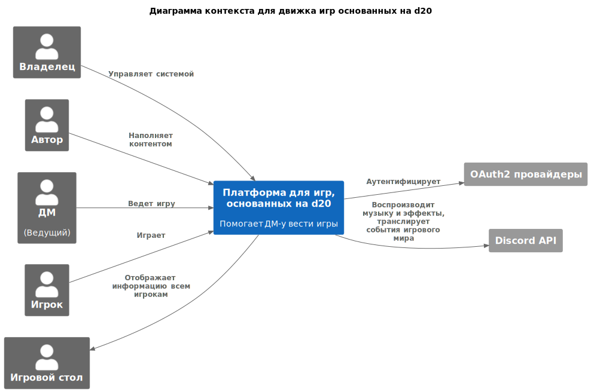

# ADR1. Внешние связи системы, диаграмма контекста

| Актуальное | Принято 20.07.23                          |
|------------|-------------------------------------------|
| Участники  | Бутаков М.В.                              |
| Изменения  | 19.07.23 - Создано 20.07.23 - Принято |

Задача: выявить связи системы с внешним миром - пользователей, внешние системы.

<!-- TOC -->
* [ADR1. Внешние связи системы, диаграмма контекста](#adr1-внешние-связи-системы-диаграмма-контекста)
  * [Роли пользователей](#роли-пользователей)
  * [Внешние связи](#внешние-связи)
  * [Решение](#решение)
  * [Последствия](#последствия)
<!-- TOC -->

## Роли пользователей

- Владелец системы, владеющий возможностью настраивать систему, приглашать пользователей, подключать модули
- Автор приключений, сценариев, заполнитель содержимого по официальным книгам - наполняет контентом
- Ведущий игры (ДМ) - создает по сценарию игровую комнату, приглашает игроков, ведет игру
- Участник игры, игрок - ищет доступные игры, принимает приглашения, создает персонажа, участвует в играх
- Игровой стол - отображает во время игры общедоступную игрокам информацию (карта местности, письма, прочие игровые
  предметы). Управляется ведущим, отображает выбранную ведущим информацию, может отсутствовать в онлайн-игровой сессии.

## Внешние связи

- Провайдеры внешней аутентификации
- Discord-канал для голосового общения, установки музыки для атмосферы, звуковых эффектов и трансляции игровых событий в
  виде текста

## Решение

## Последствия

Принятое решение особых последствий не имеет
