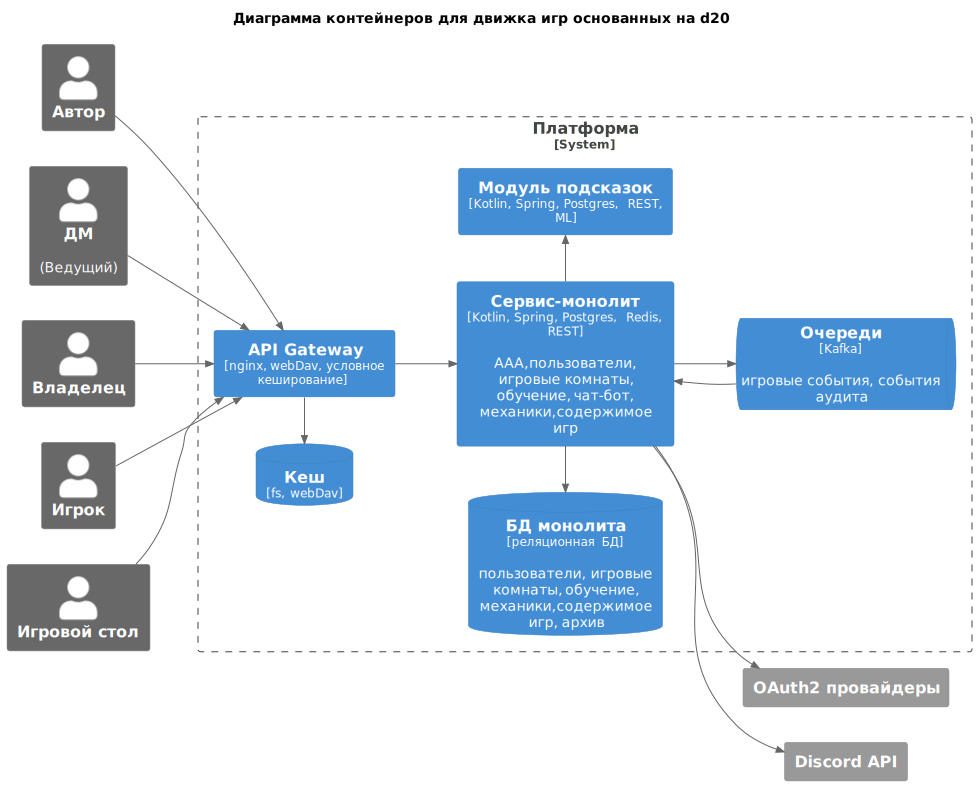

# ADR4. Верхнеуровневые модули и их связи, диаграмма контейнеров

| Актуальное | Принято 22.07.23                          |
|------------|-------------------------------------------|
| Участники  | Бутаков М.В.                              |
| Изменения  | 21.07.23 - Создано 22.07.23 - Принято |

Задача: выявить блоки предметной области, предложить разбиение на контейнеры, оформить диаграмму контейнеров.

<!-- TOC -->
* [ADR4. Верхнеуровневые модули и их связи, диаграмма контейнеров](#adr4-верхнеуровневые-модули-и-их-связи-диаграмма-контейнеров)
	* [Группировка доменов](#группировка-доменов)
	* [Варианты разбиения на контейнеры](#варианты-разбиения-на-контейнеры)
		* [v1. Микросервисы со старта](#v1-микросервисы-со-старта)
		* [v2. Сначала монолит](#v2-сначала-монолит)
	* [Решение](#решение)
<!-- TOC -->

## Группировка доменов

## Варианты разбиения на контейнеры

### v1. Микросервисы со старта

Риски:
- Много связей между компонентами осуществляются по HTTP, поэтому повлечет:
	- добавление накладных расходов при работе на сериализацию-десериализацию;
	- добавление накладных расходов при реализации на разработку, тестирование и поддержку API.
- Команда разработки только одна (+подрядчик на ML), а закон Конвея отдает предпочтение структуре ПО, отражающей
  структуру организации.
- Некоторое усложнение развертывания.

### v2. Сначала монолит

Риски:
- На первом этапе подстраивать приложение для нагрузки добавлением числа контейнеров нагруженной части получится менее
  гибко.

Выгода:
- Соответствует рекомендуемому Мартином
  Фаулером [в статье MonolithFirst](https://www.martinfowler.com/bliki/MonolithFirst.html), к этому же варианту отсылает
  закон Голла ("Работающая сложная система обязательно произошла от работавшей простой системы...")
- Интеграция компонентов происходит через общую память простыми вызовами методов, меньше накладных расходов.
	- Позволит раньше предоставить заказчику минимально рабочий образец, провести нагрузочное тестирование, выявить узкие
	  места архитектуры и по ним принимать аргументированные решения об оптимизациях или выносе частей в отдельные
	  контейнеры.

## Решение

1. Воспользоваться на первом этапе подходом Monolith First.
2. Предусмотреть разделение на ограниченные контексты внутри монолита как по коду (java/kotlin пакеты), так и по
   данным (namespace в postgres).
3. После реализации основного функционала провести нагрузочное тестирование, по результатам внести корректировки в
   диаграмму контейнеров или компонентов, провести оптимизацию и, возможно, вынос наиболее нагруженных частей.
