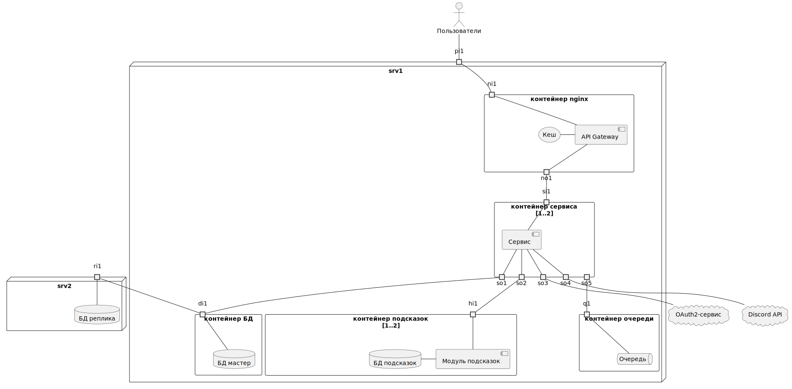

# ADR3. Развертывание

| Актуальное | Принято 22.07.23                          |
|------------|-------------------------------------------|
| Участники  | Бутаков М.В.                              |
| Изменения  | 21.07.23 - Создано 22.07.23 - Принято |

Задача: Описать диаграмму развертывания, используемые технологии

<!-- TOC -->
* [ADR3. Развертывание](#adr3-развертывание)
	* [Факторы влияющие на размещение](#факторы-влияющие-на-размещение)
	* [Решения](#решения)
	* [Диаграмма](#диаграмма)
	* [Последствия](#последствия)
<!-- TOC -->

## Факторы влияющие на размещение

1. На основе диаграммы контейнеров блоки API Gateway и Кеш имеет смысл размещать вместе, поскольку nginx основной
   кандидат на роль API Gateway умеет работать с файловой системой своего окружения
2. Для обеспечения отказоустойчивости при авариях нужно выделить БД в отдельный контейнер, с приоритетной целью -
   при любом сбое в других контейнерах БД должна продолжить работать.
3. Контейнеры для прочих блоков желательно выделять по одному на блок, это позволит точнее проводить мониторинг
   состояния блока и, при выборе позже инструментов, позволяющих проводить автоскалирование под нагрузкой - прицельнее
   добавлять контейнера с блоком, который является узким местом.
4. Контейнеры блоков, участвующих в критичных по быстродействию и нагрузке сценариях имеет смысл размещать максимально
   близко друг к другу при прочих равных факторах для снижения влияния сетевых коммуникаций на время обработки запросов.
   Такие блоки - шлюз, сервис, БД. Подсказки являются менее критичными, поскольку обращающихся к нему пользователей (ДМ)
   меньше (15-20% от числа активных пользователей), у них больше лояльность, готовы чуть дольше ждать реакции системы,
   могут импровизировать взамен использования подсказок или во время их ожидания.
5. Продукт предполагает поэтапное расширение - опытная эксплуатация, массовое применение. На первом этапе имеет смысл
   использовать достаточные для этого этапа ресурсы, не резервируя и не оплачивая ресурсы, которые потребуются для
   большей нагрузки при массовом применении.

## Решения

1. Использовать один сервер для развертывания (факторы 4 и 5).
2. Развертывание делать в контейнерах для унифицированной разработки, запусках на тестовых и боевых окружениях.
3. Для начального этапа автоскалирование не использовать.
4. Инструмент контейнеризации использовать с наименьшим порогом входа для команды (docker-compose или kubernetes)

## Диаграмма

Оранжевым выделены блоки, к которым выдвигаются повышенные требования.

## Последствия

1. Перед выходом в массовую эксплуатацию снова рассмотреть вопроса автоскалирования, и, возможно, смены инструмента
   контейнеризации и оркестрации - в случае выбора ранее docker-compose потребуется заменить на kubernetes.
