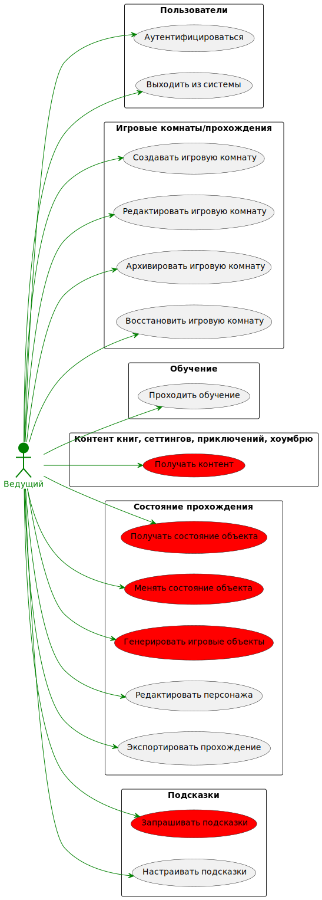

# Базовые сценарии

<!-- TOC -->
* [Базовые сценарии](#базовые-сценарии)
  * [US1. Сценарии владельца](#us1-сценарии-владельца)
  * [US2. Сценарии редактора](#us2-сценарии-редактора)
  * [US2. Сценарии ведущего](#us2-сценарии-ведущего)
  * [US2. Сценарии игрока](#us2-сценарии-игрока)
<!-- TOC -->

Красным помечены сценарии, к которым предъявляются повышенные требования.

## US1. Сценарии владельца

## US2. Сценарии редактора

## US2. Сценарии ведущего

## US2. Сценарии игрока

