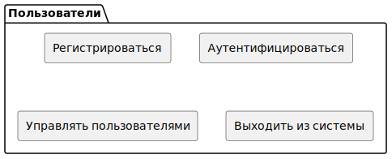
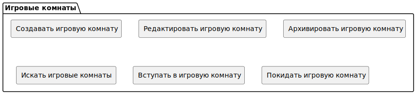
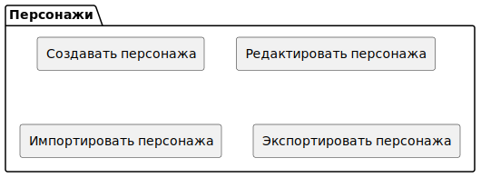

# Предметная область

Задача: выявить домены предметной области

<!-- TOC -->
* [Предметная область](#предметная-область)
	* [Группировка сценариев по затронутым объектам](#группировка-сценариев-по-затронутым-объектам)
		* [Пользователи](#пользователи)
		* [Игровые комнаты](#игровые-комнаты)
		* [Обучение](#обучение)
		* [Контент книг, сеттингов, приключений, хоумбрю](#контент-книг-сеттингов-приключений-хоумбрю)
		* [Подсказки](#подсказки)
		* [Состояние объектов кампании](#состояние-объектов-кампании)
		* [Генераторы](#генераторы)
		* [Персонажи](#персонажи)
		* [Данные прохождения](#данные-прохождения)
	* [Связи](#связи)
<!-- TOC -->

## Группировка сценариев по затронутым объектам

Оранжевым выделены критичные сценарии с повышенными требованиями

### Пользователи

### Игровые комнаты

### Обучение

### Контент книг, сеттингов, приключений, хоумбрю

**Особенности**: данные меняются редко, и практически никогда - во время партии

### Подсказки

**Особенности**: значительный объем входных данных при получении подсказок, практически все запросы можно считать
уникальными.

### Состояние объектов кампании

**Связи**: с контентом книг, сходные структуры
**Особенности**: данные меняются часто, один и тот же "слепок" данных по состоянию объектов в течение 3-5 секунд может
быть применим ко всем участникам игровой комнаты

### Генераторы

**Связи**: с состоянием объектов в кампании, генерируют объекты в компании

### Персонажи

**Связи**: с состоянием объектов в кампании, герои - один из объектов в компании

### Данные прохождения

**Связи**: с состоянием объектов в кампании, записи о событиях в прохождении связаны с множеством объектов в компании

## Связи, диаграмма

