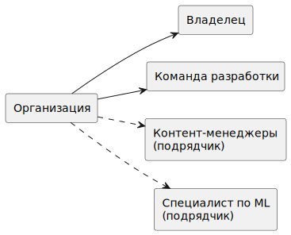
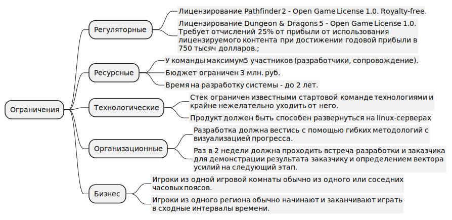
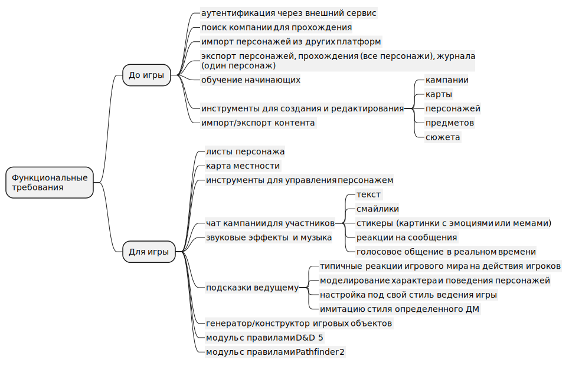
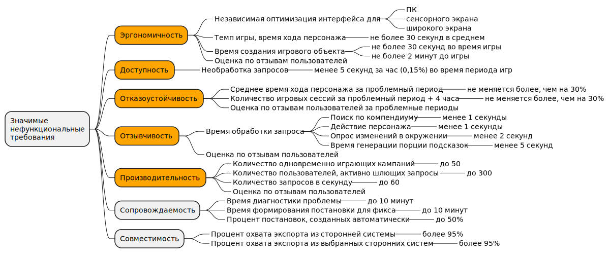

# Архитектурно значимые требования

| Актуальное | Принято 21.07.23                          |
|------------|-------------------------------------------|
| Участники  | Бутаков М.В.                              |
| Изменения  | 20.07.23 - Создано 21.07.23 - Принято |

Задача: выявить функциональные и нефункциональные требования, ограничения, выделить из них архитектурно значимые.

<!-- TOC -->
* [Архитектурно значимые требования](#архитектурно-значимые-требования)
	* [Структура организации](#структура-организации)
	* [Ограничения](#ограничения)
	* [Функциональные требования](#функциональные-требования)
	* [Нефункциональные требования](#нефункциональные-требования)
		* [Оценка важности атрибутов качества стейкхолдерами](#оценка-важности-атрибутов-качества-стейкхолдерами)
		* [Значимые сейчас](#значимые-сейчас)
		* [Значимые в перспективе](#значимые-в-перспективе)
		* [Незначительные](#незначительные)
	* [Архитектурно-значимые требования](#архитектурно-значимые-требования-1)
<!-- TOC -->

## Структура организации

## Ограничения

## Функциональные требования

## Нефункциональные требования

### Оценка важности атрибутов качества стейкхолдерами

| Атрибуты качества системы                                                                                                                | Заказчик | ДМ    | Игрок | Разработчик | Сопровождение |
|------------------------------------------------------------------------------------------------------------------------------------------|----------|-------|-------|-------------|---------------|
| В предусмотренный период любой запрос будет обслужен _(Доступность)_                                                                     | важно    | важно | важно | -           | -             |
| Сохраняет свою работоспособность после отказа одной или нескольких ее составных частей _(Отказоустойчивость)_                            | важно    | важно | важно | -           | -             |
| Быстро реагирует, для легких задач дает ответ сразу, для тяжелых задач информирует о прогрессе или прогнозах выполнения _(Отзывчивость)_ | важно    | важно | важно | -           | -             |
| Проста в использовании и понятна _(Эргономичность)_                                                                                      | важно    | важно | важно | -           | -             |
| Совместима с другими системами _(Совместимость)_                                                                                         | важно    | важно | важно | -           | -             |
| Легко диагностируется, информирует о текущем состоянии, дает информацию о ходе выполнения в прошлом _(Сопровождаемость)_                 | важно    | -     | -     | важно       | важно         |
| Быстро добавить новую локализацию _(Локализация)_                                                                                        | важно    | важно | -     | -           | -             |
| Интеграция с системой документирована _(Внешняя документация)_                                                                           | важно    | важно | -     | -           | -             |
| Внутреннее устройство документировано _(Внутренняя документация)_                                                                        | важно    | -     | -     | важно       | -             |
| Позволяет добавлять новые части без существенной переработки готовых частей _(Модифицируемость)_                                         | важно    | -     | -     | важно       | -             |
| Проста в обслуживании и обновлении _(Обслуживаемость)_                                                                                   | важно    | -     | -     | важно       | -             |
| Защищена от несанкционированного доступа _(Безопасность)_                                                                                | важно    | -     | -     | -           | -             |
| Соответствует всем применимым законам и правилам _(Легальность)_                                                                         | важно    | -     | -     | -           | -             |
| Имеет возможность увеличивать или уменьшать масштаб по мере необходимости _(Масштабируемость)_                                           | важно    | -     | -     | -           | -             |
| Способна обслуживать необходимое количество пользователей без снижения производительности _(Производительность)_                         | важно    | -     | -     | -           | -             |
| Позволяет выделить часть без масштабной переработки других частей _(Разделяемость)_                                                      | -        | -     | -     | важно       | -             |
| Есть инструкции для пользователя _(Пользовательская документация)_                                                                       | -        | -     | -     | -           | -             |
| Работает на разных платформах с минимальными изменениями _(Переносимость)_                                                               | -        | -     | -     | -           | -             |

### Значимые сейчас

Наиболее важными свойствами большинство стейкхолдеров признали следующие:
- _Доступность_, _Отказоустойчивость_, _Отзывчивость_ - базовые требования, позволяющие использовать систему по
  назначению - облегчать процесс игры, не привнося излишних проблем. Возникновение проблем в одной части функционала не
  должно катастрофически влиять на другой функционал и вызывать у пользователей ощущение "А у %конкурент% таких
  тормозов/ошибок не было!". **Это важное требование: быть не хуже, чем у основного конкурента.**
- _Эргономичность_ - сделать инструмент более удобный, чем у конкурентов, настолько удобно
  решающий недостатки и затраты времени в других системах, чтобы за этот инструмент пользователь был готов заплатить.
  **Это важное требование: быть удобнее, чем основной конкурент.**
- _Совместимость_ - интеграция с форматами описания персонажа у самых популярных конкурентов для упрощения перехода
  (импорта) в разрабатываемую систему, для снижения порога входа и возможности достаточно быстро набрать пользователей.
- _Сопровождаемость_ - диагностика должна быть максимально упрощена, эксплуатирующий не должен обладать специфичными
  техническими знаниями, на диагностику происходившего в системе должно уходить не более 10-15 минут, по-возможности
  автоматизация обработки непредвиденных ситуаций (триггеры), отсутствует необходимость постоянно мониторить графики и
  состояние системы, при необходимости реагирования - выдача советов эксплуатирующему. Желательна интеграция с формой
  жалоб, замечаний и опросов, чтобы по сигналу от пользователей можно было проанализировать потенциальные проблемы у
  указанного пользователя или сессии.
- _Производительность_ - для графика онлайна пользователей характерна волнообразность, как следствие распределения
  свободного времени у игроков, когда большинство игроков освобождается от работы или учебы и может выделить часть
  времени на игру. В кампанию, как правило, подбираются игроки из одного часового пояса или из двух соседних, чтобы
  удобнее было находить время на игру, удобное для каждого. Типичная сессия длится от 2 до 6 часов с наиболее частой
  длительностью в 3-4 часа. Основная волна активности в будни резко начинается после 17-18 часов по местному времени и
  длится до 24-01 часов. В выходные волна активности плавно начинается с 12 часов и плавно заканчивается в 20-24.
  Производительность системы не должна ощутимо падать во время пикового значения онлайна.
- _Масштабируемость_ - при росте числа активных пользователей из определенного часового пояса и прогнозировании там
  увеличения нагрузки нужно достаточно легко увеличить ресурсы в этом часовом поясе для предотвращения снижения
  производительности системы во время пика онлайна и активных игры.

### Значимые в перспективе

Менее значимыми стейкхолдерами обозначены, и для которых момент выхода в широкую эксплуатацию может изменить значимость:
- _Модифицируемость_ - на самом деле достаточно важная характеристика, перекликается с функциональным требованием охвата
  разных игровых систем. Нужно заложить возможность подключения плагинов с игровыми системами и генераторами объектов на
  раннем этапе, однако польза будет получена в момент подключения 2-й и последующих игровых систем.
- _Обслуживаемость_ - полезная характеристика, развертывание упрощено, автоматические проверки перед публикацией
  изменений, анализаторы технического долга.
- _Локализация_ - востребовано после выхода в широкую эксплуатацию и распространения за пределы русскоязычных стран.
- Наличие разных видов _документации_ будет полезно на более поздних этапах жизненного цикла системы, снижает риски
  утраты знаний о системе при смене команды разработки/сопровождения.
- _Легальность_ - не играет решающей роли до момента выхода в широкую эксплуатацию. Возможные влияния на систему исходят
  из сферы авторских прав и получения платежей. При распространении за пределы РФ может потребовать дополнительных
  исследований и затрат.

### Незначительные

Менее значимы и не играют особой роли ни до выхода в широкую эксплуатацию, ни после:
- _Безопасность_ - не играет решающей роли, поскольку система не хранит персональных, конфиденциальных, медицинских и
  т.д. чувствительных данных, за ненадлежащую обработку или утечку которых могут примениться санкции. Однако отдельно
  стоит добавить автоматическую проверку кода на типичные уязвимости (OWASP), что перекликается с _Обслуживаемостью_, и
  предотвратит инциденты, ведущие к отказу в обслуживании.
- _Разделяемость_ - в обозримом будущем не потребуется выделять части, помимо изначальных функциональных блоков, ни для
  более точного управления нагрузкой, ни для отдельных развертываний и запусков. Появление дополнительной команды
  разработки, разделение кода согласно _закону Конвея_ возможно только в отношении модуля с обучением и подсказками (при
  появлении специалистов с глубокими компетенциями в ML), который рекомендуется сразу выделить отдельно. Гораздо чаще
  будет возникать задача расширения функционала, решаемая плагинами для обеспечения _Модифицируемости_.
- _Пользовательская документация_ - планируется решать за счет подсказок и обучений, заложенных в пункте
  _Эргономичность_. Возможно, однажды часть этих знаний оформится как отдельный вики-проект или форум пользователей,
  заполняемый пользователями, модерируемый Заказчиком, командами разработки и сопровождения.

## Архитектурно-значимые требования

В качества архитектурно-значимых требований взяты требования к 5 атрибутам качества:

| Аттрибут           | Критерии проверки и оценки                         | Инструменты удовлетворения требований                                                                                                                        |
|--------------------|----------------------------------------------------|--------------------------------------------------------------------------------------------------------------------------------------------------------------|
| Эргономичность     | <li>метрики<li>тестирование UI<li>A/B тестирование |                                                                                                                                                              |
| Доступность        |                                                    |                                                                                                                                                              |
| Отказоустойчивость |                                                    |                                                                                                                                                              |
| Отзывчивость       |                                                    | <li>резервирование<li>аварийное переключение<li>graceful degradation<li>CQRS<li>идемпотентные и коммутативные запросы<li>Оптимизация запросов<li>Кеширование |
| Производительность | Нагрузочное тестирование                           |                                                                                                                                                              |

* Эргономичность.
  Критерии будут определяться по метрикам, результатам тестирования пользовательского интерфейса, A/B
  тестированием и в некоторой степени сбором отзывов от пользователей.
