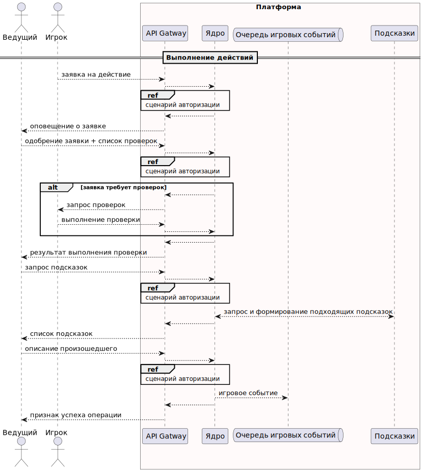
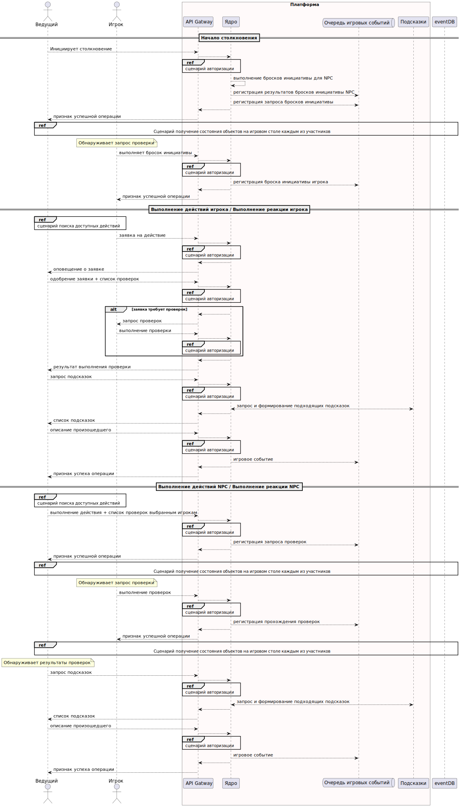

# диаграммы последовательности

Задача: выявить функциональные и нефункциональные требования, ограничения, выделить из них архитектурно значимые.

<!-- TOC -->
* [диаграммы последовательности](#диаграммы-последовательности)
	* [Сценарии, общие для всех пользователей](#сценарии-общие-для-всех-пользователей)
		* [Аутентификация](#аутентификация)
		* [Авторизация](#авторизация)
		* [Изменение профиля](#изменение-профиля)
		* [Прохождение обучения](#прохождение-обучения)
		* [Выход из системы](#выход-из-системы)
	* [Сценарии владельца системы](#сценарии-владельца-системы)
	* [Сценарии редактора контента](#сценарии-редактора-контента)
	* [Сценарии ведущего](#сценарии-ведущего)
	* [Сценарии игрока](#сценарии-игрока)
	* [Сценарии игры](#сценарии-игры)
		* [Отдых и Исследование](#отдых-и-исследование)
		* [Столкновение](#столкновение)
<!-- TOC -->

## Сценарии, общие для всех пользователей

### Аутентификация

### Авторизация

### Изменение профиля

### Прохождение обучения

### Выход из системы

## Сценарии владельца системы

## Сценарии редактора контента

## Сценарии ведущего

## Сценарии игрока

## Сценарии игры

### Общие действия

### Отдых и Исследование

### Столкновение

